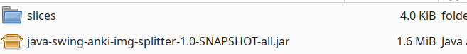
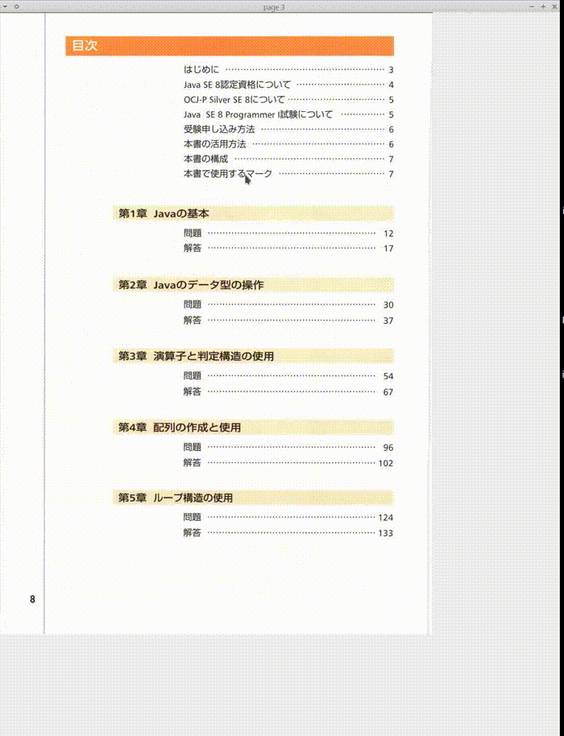
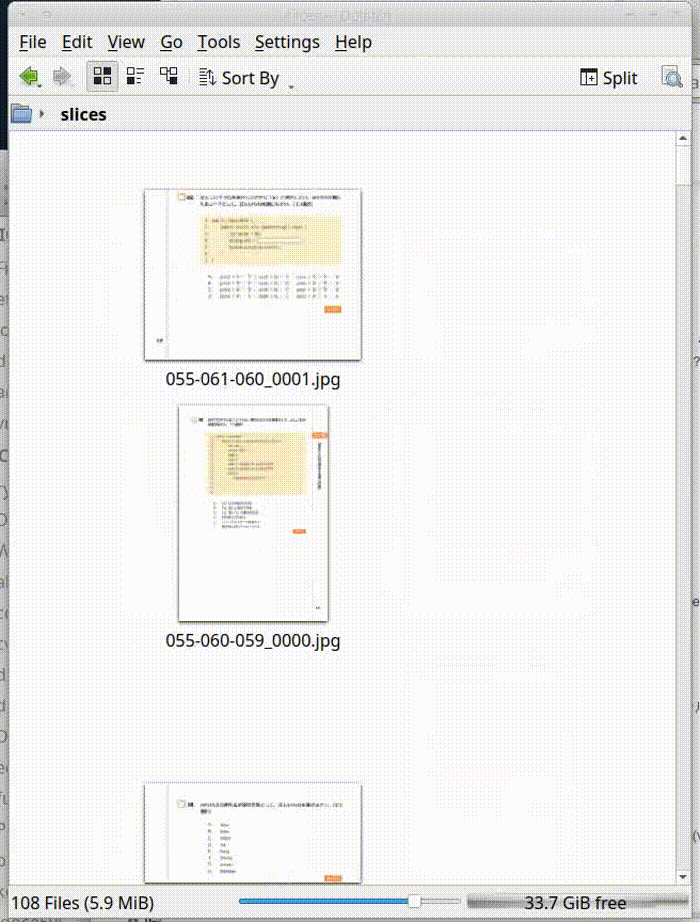

# java-swing-image-slicer

This project has only one file of Kotlin code: [App.kt](https://github.com/growingspaghetti/java-swing-image-slicer/blob/main/src/main/kotlin/App.kt)

I couldn't find this sort of utility app.

# Usage
Specify a directory containing the images to slice.
```shell
$ java -jar java-swing-anki-img-splitter-1.0-SNAPSHOT-all.jar '/home/ryoji/archive/math/java/055' 
loading page 0
678
211
```
Starting page index can be specified if you prefer.
```shell
$ java -jar java-swing-anki-img-splitter-1.0-SNAPSHOT-all.jar '/home/ryoji/archive/math/java/055' 5
loading page 5
307
747
loading page 6
```

# Screenshots
Split images are placed in *slices* directory under the current directory.



Mouse clicks define the horizontal lines to cut, and pressing the *Enter* key does the slicing.



